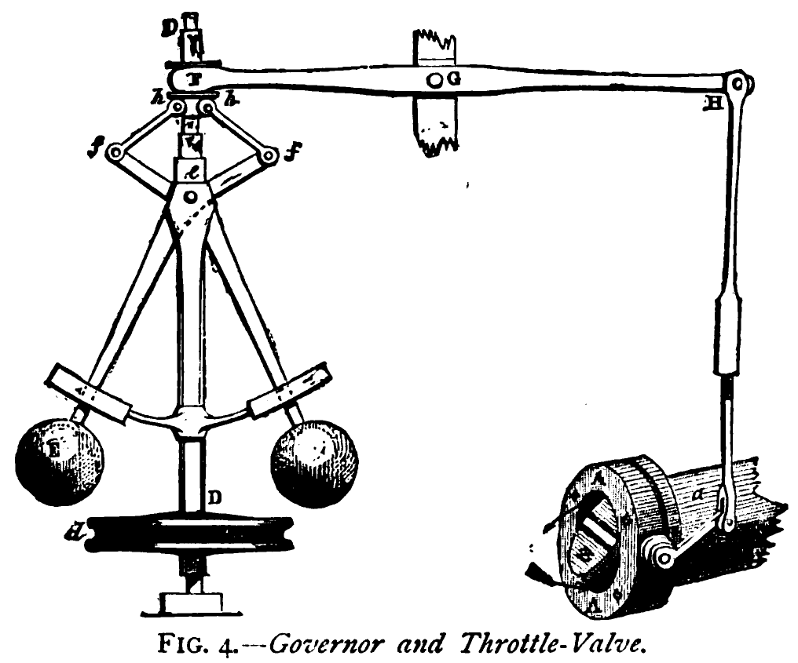

# governor - a library for regulating the flow of data

This library is an implementation of the [Generic Cell Rate
Algorithm](https://en.wikipedia.org/wiki/Generic_cell_rate_algorithm)
for rate limiting in Rust programs.

It is intended to help your program know how much strain it is
supposed to put on external services (and, to some extent, to allow
your services to regulate how much strain they take on from their
users). In a way, it functions like the iconic steam governor from
which this library takes its name:

## Implementation and constraints

The rate-limiting algorithms in this crate are implemented using the
Generic Cell Rate Algorithm (GCRA). The GCRA is functionally
equivalent to a leaky bucket, but has a few advantages over most
leaky bucket implementations:

* No background "drip" process is necessary to keep up maintenance on
  the bucket,
* it updates its state, whenever a request comes in, continuously on a
  nanosecond scale, and
* it keeps its state in a single `AtomicU64` integer.

The rate-limiting state used here does not take up much memory (only
64 bits!) and is updated thread-safely with a compare-and-swap
operation. Compared to `ratelimit_meter`'s implementation using
Mutexes, it is on average 10x faster when used on multiple threads.

### Constraints

The speed comes at a slight cost: Each rate-limiter and its state is
only useful for 584 years after creation. If you are trying to power
the [Long Now Foundation](http://longnow.org/)'s computers with this
library, please get in touch.
